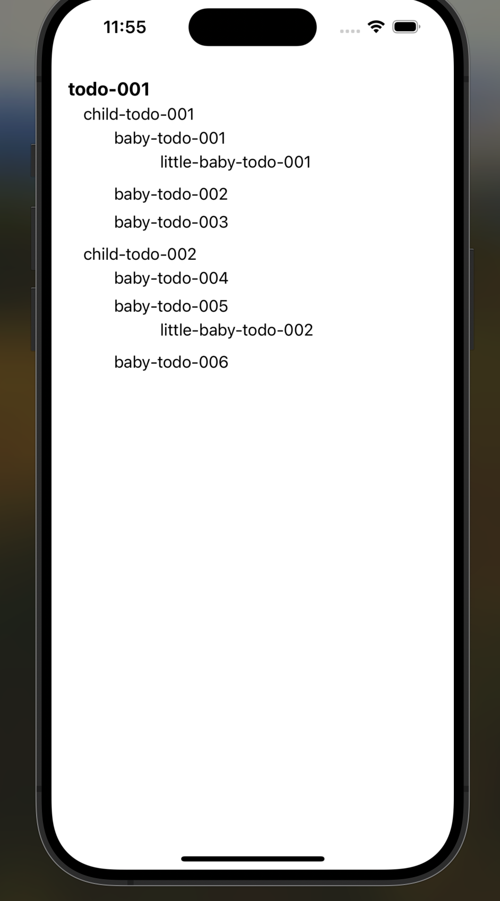

# Nested To Dos React Native

This is the source code for my blog post, "React Native: How to Reverse Nested Datasets for Optimized Rendering."

## Usage

To use this project, you may clone the repo, then follow the steps below.

1. run `yarn`.
2. run `yarn start`.
3. Follow the instructions in the terminal, such as clicking `i` to run in ios and `a` to run on android.  

Below is the end result of the app after running `cleanseNestedTodos` method. 

